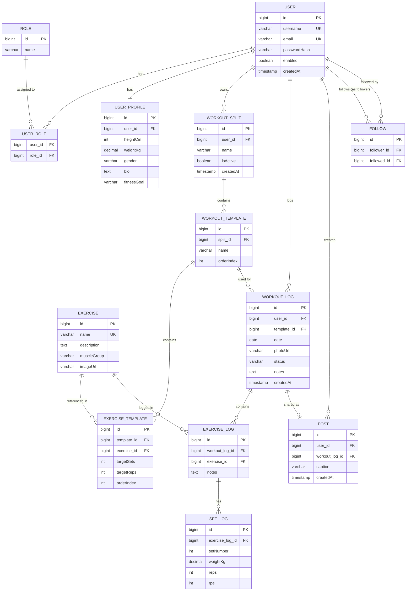
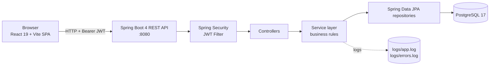
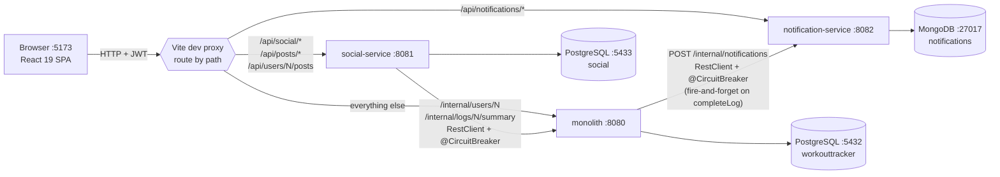

# WorkoutTracker

> Faculty project for the course **Web Applications with Microservices**

A full-stack workout tracking application built with Spring Boot and React.

---

## Functional Requirements

### Authentication & Authorization
- Users can register with a unique username, email, and password
- Users can log in and receive a JWT token valid for 24 hours
- All endpoints except exercise browsing and authentication require a valid JWT
- Two roles exist: `ROLE_USER` (default) and `ROLE_ADMIN`
- Admins can create, update, and delete exercises; regular users cannot

### User Profile
- Each user has a profile with optional fields: height, weight, gender, bio, and fitness goal
- Users can view and edit their own profile
- Users can view other users' public profiles

### Exercise Catalog
- Admins can add exercises with name, description, muscle group, and image URL
- All users (including unauthenticated) can browse and search exercises by name or filter by muscle group
- Exercise listing is paginated and sortable

### Workout Splits & Templates
- Users can create named workout splits (e.g. "Push/Pull/Legs")
- A user can have at most one active split at a time; activating a new split deactivates the current one
- Each split contains ordered workout day templates (e.g. "Push Day")
- Each template lists exercises from the global catalog with optional target sets and reps

### Workout Logging
- Users can create a workout log against a template from their active split, with a date and optional photo URL
- Users can add exercise logs and set logs (weight × reps, optional RPE 1–10) to a workout log
- Users can mark a workout log as **Completed**
- Users can view their full workout history, paginated and sorted by date

### Social Features
- Users can follow and unfollow other users (a user cannot follow themselves)
- Users can share a completed workout as a post with an optional caption
- Users can view a paginated feed of posts from users they follow
- Users can view another user's public posts and profile

---

## ERD Diagram



---

## Architecture

The application is a classic three-tier monolith with a JWT-secured REST API and an SPA client.



Notable design choices:

- **JWT** stateless auth (HMAC-SHA256, 24h expiry) — no server-side session state
- **Service-layer business rules**: one-active-split, owner-only mutations, no self-follow — enforced before persistence, never relying on DB constraints alone
- **DTOs** (Java records) at every controller boundary — entities are never serialized directly
- **Pagination** on `/api/logs`, `/api/exercises`, `/api/social/feed`, `/api/users/{id}/posts`
- **Custom exception hierarchy** mapped to HTTP status codes by `GlobalExceptionHandler`

---

## Social Layer

The social layer is a thin layer on top of the workout domain. It exists so users can
share completed workouts and discover others' training. It deliberately has no comments,
likes, or reactions — the goal is to surface *what people lifted*, not to be a feed app.

### Two entities, two services

| Entity | Service | Purpose |
|---|---|---|
| [`Follow`](backend/src/main/java/com/workout_tracker/backend/model/Follow.java) | [`SocialService`](backend/src/main/java/com/workout_tracker/backend/service/SocialService.java) | Self-referential `User ↔ User` edge — who follows whom |
| [`Post`](backend/src/main/java/com/workout_tracker/backend/model/Post.java) | [`PostService`](backend/src/main/java/com/workout_tracker/backend/service/PostService.java) | A share of a completed `WorkoutLog` with an optional caption |

`Follow` has a unique constraint on `(follower_id, followed_id)` so the database is the
final backstop, but each business rule is pre-checked in the service layer so the
client gets a domain-specific 409 message instead of a generic constraint violation.

### Following

```
POST   /api/social/follow/{userId}      → 201 Created      (creates a Follow)
DELETE /api/social/follow/{userId}      → 204 No Content
GET    /api/social/following            → [UserSummaryDto] (who I follow)
GET    /api/social/followers            → [UserSummaryDto] (who follows me)
GET    /api/users/{id}/following        → [UserSummaryDto] (public — anyone's graph)
GET    /api/users/{id}/followers        → [UserSummaryDto]
```

Rules enforced in `SocialService.follow`:

- **Rule #4 (no self-follow)** — `follower.id == followedId` → 409 `BusinessRuleViolationException`
- **No duplicate follow** — pre-checked with `existsByFollowerAndFollowed`; the unique constraint is the backstop
- **Followed user must exist** — 404 if not

### Posting

```
POST   /api/posts                       → 201 PostDto
DELETE /api/posts/{id}                  → 204 No Content   (only the author can delete)
GET    /api/users/{id}/posts?page=&size= → PageResponse<PostDto>
```

Rules enforced in `PostService.createPost`:

- **Rule #3 (owner-only)** — the `WorkoutLog` referenced in `CreatePostRequest` is fetched via
  `findByIdAndUser(logId, currentUser)`. A non-owner sees the same 404 as a missing log,
  so we don't leak which log IDs exist.
- **Completed-only** — `WorkoutLog.status` must be `COMPLETED`. Sharing an `IN_PROGRESS`
  log throws 409.
- **One post per log** — `postRepository.existsByWorkoutLog` rejects duplicates.

### The Feed

```
GET    /api/social/feed?page=&size=     → PageResponse<PostDto>
```

The feed is "posts from users I follow, newest first." Composition logic in
[`PostService.getFeed`](backend/src/main/java/com/workout_tracker/backend/service/PostService.java):

1. Resolve the current user's follow list to a `List<Long> followedIds`.
2. If empty, short-circuit to `Page.empty(pageable)` — some JPA providers reject `WHERE
   user_id IN ()`, so we avoid issuing it.
3. Otherwise, `postRepository.findByUser_IdInOrderByCreatedAtDesc(followedIds, pageable)`.

The feed contains posts only — not the underlying `WorkoutLog` payload. Each `PostDto`
carries the log id, template name, caption, and author username; the frontend links to
[`/logs/{id}`](frontend/src/pages/LogDetailPage.tsx) for the full set-by-set view, which
hits its own paginated endpoint behind JWT auth.

### Privacy posture

- Profiles and follower/following counts are **public** to authenticated users — anyone
  with a token can hit `/api/users/{id}/profile`.
- Posts are visible to **anyone who follows the author**, via the feed, or directly via
  `/api/users/{id}/posts` (also public to authenticated users).
- Workout logs themselves remain **strictly owner-only** — there is no
  `/api/logs/{id}` route that resolves to another user's log. The post-detail page
  fetches the log via `/api/logs/{id}` which requires owner match; sharing a log
  effectively makes its summary data (date, template, caption) visible via the post,
  but the underlying log endpoint stays private. (This is intentional — the grading is
  in the post; reps/weights are still owner-private unless you choose to denormalize
  them onto the post.)

---

## Microservices Architecture

Three services share the API surface: the monolith, an extracted **`social-service`**
(posts + follows on its own Postgres), and a **`notification-service`** (Mongo-backed,
fired from the monolith on workout completion). The microservice patterns follow the
conventions in [`iuliabanu/awbd2026/product-hub`](https://github.com/iuliabanu/awbd2026/tree/main/product-hub),
adapted to our existing stack.



### What lives where

| Concern | Owner |
|---|---|
| Auth, register/login, JWT issuance | monolith |
| User, UserProfile, Role | monolith |
| WorkoutSplit, WorkoutTemplate, Exercise, WorkoutLog, ExerciseLog, SetLog | monolith |
| `Follow`, `Post` entities + their schema | **social-service** |
| `/api/social/**`, `/api/posts/**`, `/api/users/{id}/posts` (routed by Vite) | **social-service** |
| `/internal/users/{id}`, `/internal/logs/{id}/summary` | monolith (for social-service to call back) |
| `Notification` documents (MongoDB) | **notification-service** |
| `/api/notifications/**` (list, unread-count, mark-read) | **notification-service** |
| `/internal/notifications` (fired by monolith on `completeLog`) | **notification-service** |

### Severed JPA relationships

In the monolith, `Post.user` is a `@ManyToOne User` and `Post.workoutLog` is a
`@OneToOne WorkoutLog`. The social-service owns neither entity nor their database, so
both fields become bare `Long` ids. Referential integrity is now the application's
job — `PostService.createPost` calls back to the monolith via `MainAppClient` to
verify the workout log exists, is owned by the current user, and is `COMPLETED` before
inserting a row.

### Inter-service communication: RestClient + Resilience4j

Follows the `DiscountClient` pattern from `product-hub/product-api-app` exactly:

```java
@CircuitBreaker(name = "main-app", fallbackMethod = "getUserFallback")
public UserSummaryDto getUser(Long userId) {
    return mainAppRestClient.get()
            .uri("/internal/users/{id}", userId)
            .retrieve()
            .body(UserSummaryDto.class);
}

private UserSummaryDto getUserFallback(Long userId, Throwable cause) {
    log.warn("MainApp getUser({}) → fallback: {}", userId, cause.toString());
    return new UserSummaryDto(userId, "Unknown", null);
}
```

Configured in `application.properties`:

```properties
resilience4j.circuitbreaker.instances.main-app.sliding-window-size=5
resilience4j.circuitbreaker.instances.main-app.failure-rate-threshold=50
resilience4j.circuitbreaker.instances.main-app.wait-duration-in-open-state=15s
resilience4j.circuitbreaker.instances.main-app.permitted-number-of-calls-in-half-open-state=2
```

If 50% of the last 5 calls to the monolith fail, the breaker opens for 15s and
fallbacks return immediately. Reads (feed enrichment) degrade to `"Unknown"`
placeholders; writes (post creation) refuse with **503 Service Unavailable** instead
of inserting unverified rows.

Live state visible at `GET /actuator/circuitbreakers` on the social-service.

A **second circuit breaker** lives in the monolith for outbound calls to
notification-service ([NotificationClient.java](backend/src/main/java/com/workout_tracker/backend/client/NotificationClient.java)).
Notifications are fire-and-forget — when the breaker is open, completing a workout still
succeeds, the fallback just logs the miss. This satisfies the spec's "Circuit Breaker
for minimum 2 services" requirement.

### Cross-service authentication

Both services share a single `JWT_SECRET` (Base64-encoded HMAC key). The monolith
**issues** tokens; the social-service **validates** them independently. The JWT now
carries a `userId` claim so social-service can resolve the caller without a
username-to-id lookup over the network.

This is the deviation from `product-hub`, which uses Keycloak + asymmetric JWKs.
The trade-off: a shared symmetric secret is simpler to deploy for a course project,
but rotating the secret requires restarting both services. A production setup would
swap in Keycloak (`oauth2-resource-server`) without touching the controllers — the
JWT filter is the only piece that changes.

### Service discovery

No Eureka, no Spring Cloud Config — same choice as `product-hub`. The social-service
finds the monolith via the `MAIN_APP_URI` env var (default `http://localhost:8080`
in dev, `http://backend:8080` in docker-compose). Docker DNS is the registry.

### Running all services locally

```bash
# Terminal 0 — data stores (postgres × 2, mongodb)
docker compose up -d

# Terminal 1 — monolith (port 8080)
cd backend && ./gradlew bootRun

# Terminal 2 — social-service (port 8081)
cd microservices/social-service && ./gradlew bootRun

# Terminal 3 — notification-service (port 8082)
cd microservices/notification-service && ./gradlew bootRun

# Terminal 4 — frontend (Vite on 5173, proxies to all three backends)
cd frontend && npm run dev
```

All three backend services pick up `JWT_SECRET` from the same root-level `.env` file
via their `bootRun` env-loader.

### Files of interest

| File | What it does |
|---|---|
| [microservices/social-service/src/main/java/com/workout_tracker/social/client/MainAppClient.java](microservices/social-service/src/main/java/com/workout_tracker/social/client/MainAppClient.java) | social-service → monolith `@CircuitBreaker` RestClient |
| [backend/src/main/java/com/workout_tracker/backend/client/NotificationClient.java](backend/src/main/java/com/workout_tracker/backend/client/NotificationClient.java) | monolith → notification-service fire-and-forget `@CircuitBreaker` client |
| [microservices/notification-service/src/main/java/com/workout_tracker/notification/model/Notification.java](microservices/notification-service/src/main/java/com/workout_tracker/notification/model/Notification.java) | Mongo `@Document` — NoSQL backing for notifications |
| [microservices/social-service/src/main/java/com/workout_tracker/social/security/JwtAuthenticationFilter.java](microservices/social-service/src/main/java/com/workout_tracker/social/security/JwtAuthenticationFilter.java) | Validates the monolith-issued JWT independently (mirrored in notification-service) |
| [backend/src/main/java/com/workout_tracker/backend/controller/InternalController.java](backend/src/main/java/com/workout_tracker/backend/controller/InternalController.java) | `/internal/` projections the social-service calls into |
| [frontend/vite.config.ts](frontend/vite.config.ts) | Path-based proxy split between the three backends |

---

## Tech Stack

| Layer | Technology |
|---|---|
| Backend | Spring Boot 4.0.3, Java 21 |
| Frontend | React 19, TypeScript 5.9, Vite 8 |
| Database | PostgreSQL 17 |
| Auth | Spring Security + JWT (jjwt 0.13) |
| Styling | Tailwind CSS v4 |
| HTTP Client | Axios 1.13 |

---

## Prerequisites

- [Docker](https://www.docker.com/) & Docker Compose
- JDK 21
- Node.js 20+

---

## Getting Started

### 1. Clone the repository

```bash
git clone <repo-url>
cd WorkoutTracker
```

### 2. Configure environment variables

Copy [`.env.example`](.env.example) to `.env` and fill in the values:

```bash
cp .env.example .env
```

Required variables (full list in `.env.example`):

| Variable | Required | Default | Purpose |
|---|---|---|---|
| `JWT_SECRET` | ✅ | — | HMAC secret for token signing (min 32 chars) |
| `ADMIN_PASSWORD` | dev: optional<br/>prod: ✅ | dev: `admin123` | Seeded admin user password |
| `DB_URL` | optional | `jdbc:postgresql://localhost:5432/workouttracker` | JDBC URL |
| `DB_USERNAME` | optional | `postgres` | DB user |
| `DB_PASSWORD` | optional | `postgres` | DB password |

> `JWT_SECRET` has no default — the backend will refuse to start without it.

### 3. Start the database

```bash
docker compose up -d
```

### 4. Start the backend

```bash
cd backend
export $(cat ../.env | xargs) && ./gradlew bootRun
```

Backend runs on `http://localhost:8080`. Verify with:

```bash
curl http://localhost:8080/actuator/health
# {"status":"UP"}
```

### 5. Start the frontend

```bash
cd frontend
npm install
npm run dev
```

Frontend runs on `http://localhost:5173`. The Vite dev server proxies `/api/*` → `localhost:8080`.

---

## Project Structure

```
WorkoutTracker/
├── backend/
│   └── src/main/java/com/workout_tracker/backend/
│       ├── config/        # Security, CORS, beans
│       ├── controller/    # REST controllers
│       ├── dto/           # Request/response objects
│       ├── exception/     # Global error handling
│       ├── model/         # JPA entities
│       ├── repository/    # Spring Data repositories
│       └── service/       # Business logic
├── frontend/
│   └── src/
│       ├── api/           # Axios instances & API calls
│       ├── components/    # Reusable UI components
│       ├── context/       # React context providers
│       ├── hooks/         # Custom hooks
│       ├── pages/         # Route-level components
│       └── types/         # TypeScript interfaces
├── docker-compose.yml     # PostgreSQL service
└── .env                   # Local environment variables (not committed)
```

---

## Backend Dependencies

| Dependency | Purpose |
|---|---|
| `spring-boot-starter-webmvc` | REST API |
| `spring-boot-starter-data-jpa` | ORM / database access |
| `spring-boot-starter-security` | Authentication & authorization |
| `spring-boot-starter-validation` | Request validation |
| `spring-boot-starter-actuator` | Health & metrics endpoints |
| `jjwt-api / impl / jackson` | JWT token handling |
| `lombok` | Boilerplate reduction |
| `postgresql` | Production database driver |
| `h2` | In-memory database for tests |

## Frontend Dependencies

| Dependency | Purpose |
|---|---|
| `react` + `react-dom` | UI framework |
| `react-router` | Client-side routing |
| `axios` | HTTP requests to backend |
| `tailwindcss` | Utility-first styling |

---

## API Reference

All endpoints are prefixed with `/api`. JWT required unless noted.

| Method | Endpoint | Auth | Description |
|---|---|---|---|
| POST | `/auth/register` | public | Create a user, returns JWT |
| POST | `/auth/login` | public | Returns JWT |
| GET | `/users/me/profile` | user | Current user's profile |
| PUT | `/users/me/profile` | user | Update profile (height, weight, bio, goal, gender) |
| GET | `/users/{id}/profile` | user | View any user's public profile |
| GET | `/users/{id}/posts` | user | A user's posts (paginated) |
| GET | `/exercises` | **public** | Catalog (paginated, sortable, filter by muscleGroup, search by name) |
| GET | `/exercises/{id}` | **public** | Single exercise |
| POST | `/exercises` | **admin** | Create exercise |
| PUT | `/exercises/{id}` | **admin** | Update exercise |
| DELETE | `/exercises/{id}` | **admin** | Delete exercise |
| GET | `/splits` | user | All splits for current user |
| GET | `/splits/active` | user | Current active split (≤1) |
| POST | `/splits` | user | Create split |
| PUT | `/splits/{id}/activate` | user | Activate (deactivates others) |
| DELETE | `/splits/{id}` | user | Delete |
| POST | `/splits/{splitId}/templates` | user | Add template to split |
| POST | `/splits/{splitId}/templates/{templateId}/exercises` | user | Add exercise to template |
| GET | `/logs` | user | History (paginated by date) |
| POST | `/logs` | user | Start a workout log |
| POST | `/logs/{id}/complete` | user | Mark workout completed |
| POST | `/logs/{logId}/exercises` | user | Add exercise to log |
| POST | `/logs/{logId}/exercises/{exLogId}/sets` | user | Log a set (weight × reps + optional RPE) |
| PUT | `/logs/{logId}/exercises/{exLogId}/sets/{setId}` | user | Update set |
| POST | `/posts` | user | Share a completed log as a post |
| POST | `/social/follow/{userId}` | user | Follow a user |
| DELETE | `/social/follow/{userId}` | user | Unfollow |
| GET | `/social/feed` | user | Feed of posts from followed users (paginated) |
| GET | `/social/discovery` | user | Posts from users you don't yet follow (paginated) |
| GET | `/social/following` / `/followers` | user | Lists |
| GET | `/internal/users/{id}` | (internal) | UserSummary for cross-service lookup — not on the gateway |
| GET | `/internal/logs/{id}/summary` | (internal) | LogSummary (id, ownerId, status, templateName) for social-service post-creation gating |

Error responses follow a consistent shape:
```json
{ "status": 404, "error": "Not Found", "message": "WorkoutSplit not found", "timestamp": "..." }
```

---

## Testing

Run the full test suite + JaCoCo coverage report:

```bash
cd backend
./gradlew test jacocoTestReport
```

HTML report at `backend/build/reports/jacoco/test/html/index.html`.

Current coverage (excluding `dto/`, `model/`, `config/`, `exception/`):

| Package | Line coverage |
|---|---|
| `service` | **85.8 %** |
| `security` | **94.9 %** |
| `controller` | 65.8 % |
| **Overall** | **84.1 %** |

Suite: 104 tests across unit (Mockito) and integration (MockMvc + H2) levels — 0 failures.

---

## Screenshots

Available in [`docs/screenshots/`](docs/screenshots/):

| File | Description |
|---|---|
| `login.png` | Login form |
| `dashboard.png` | Dashboard with active split + recent history |
| `new-workout.png` | Logging a workout with sets |
| `history.png` | Paginated workout history |
| `exercises.png` | Public exercise catalog with muscle-group filter |
| `feed.png` | Social feed of followed users' posts |

---

## Team

Solo project by **Horia Marinescu**.

---

## License

University project — not licensed for public reuse.
